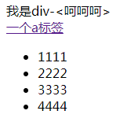

>**ES6**  
---

- [1. 语言标准](#1-%E8%AF%AD%E8%A8%80%E6%A0%87%E5%87%86)
- [2. let const](#2-let-const)
- [3. 解构赋值](#3-%E8%A7%A3%E6%9E%84%E8%B5%8B%E5%80%BC)
- [4. 字符串相关](#4-%E5%AD%97%E7%AC%A6%E4%B8%B2%E7%9B%B8%E5%85%B3)
- [5. 函数](#5-%E5%87%BD%E6%95%B0)
- [6. 扩展运算符、Rest运算符](#6-%E6%89%A9%E5%B1%95%E8%BF%90%E7%AE%97%E7%AC%A6rest%E8%BF%90%E7%AE%97%E7%AC%A6)
- [7. 数组](#7-%E6%95%B0%E7%BB%84)
- [8. 对象语法](#8-%E5%AF%B9%E8%B1%A1%E8%AF%AD%E6%B3%95)
- [9. Promise](#9-promise)
- [10. 模块化](#10-%E6%A8%A1%E5%9D%97%E5%8C%96)
- [11. 类](#11-%E7%B1%BB)
- [12. Symbol](#12-symbol)
- [13. generator & async & await](#13-generator--async--await)
- [14. Set](#14-set)
- [15. Map](#15-map)
- [16. 数学新增](#16-%E6%95%B0%E5%AD%A6%E6%96%B0%E5%A2%9E)
- [17. 命名捕获](#17-%E5%91%BD%E5%90%8D%E6%8D%95%E8%8E%B7)
- [18. Proxy](#18-proxy)

---
# 1. 语言标准  
ECMAScript 262  
任何人都可以向标准委员会（TC39），要求更改语言标准。  
提案变成标准，经历5个阶段。  

 | 阶段   | 作用             |
 | ------ | ---------------- |
 | stage0 | 展示阶段         |
 | stage1 | 征求意见阶段     |
 | stage2 | 草案阶段(babel)  |
 | stage3 | 候选阶段         |
 | stage4 | 定案阶段（标准） |

# 2. let const  
```js  
let a = 1;
function fn(){
  console.log(a); //TDZ开始 暂时性死区  
  let a = 1; //TDZ 结束
}
```  
> let 注意  
1. 没有预解析，不存在变量提升。在代码块内，只要let定义变量，在之前使用，都是报错。先定义，再使用。
2. 同一个作用域不能重复定变量。  
3. for循环，for循环里面是父级作用域，里面又一个作用域。

```js  
{
  let a = 1;
  {
    let a = 2;
    console.log(a); //2
  }  
  console.log(1); //1
}
```  
```js  
// 引用
const arr = ['1','2'];
arr.push('3');
console.log(arr); //['1','2','3']
```
**Object.freeze(对象) 冻结对象**  
# 3. 解构赋值  
解构赋值左右两边保持一致  
```js  
let [a, b, c] = [1, 2, 3];
console.log(a, b, c); // 1, 2, 3
let [a, b, c] = [1, [2, 3]];
console.log(a, b, c); // 1, [2, 3], undefined
```  
解构时可以换名，也可给默认值。  
解构{}，有时会被当做块级作用域。  
```js  
let [a, b, c:d] = [1, 2, 3];
console.log(a, b, d); // 1, 2, 3
let [a, b, c=4] = [1, 2];
console.log(a, b, c); // 1, 2, 4
let [a, b, c=4] = [1, 2, undefined];
console.log(a, b, c); // 1, 2, 4
let [a, b, c=4] = [1, 2, null];
console.log(a, b, null); // 1, 2, null
```  
```js  
alert(top) // window  
function getPos() {
  // xxx  
  return {
    left: 10,
    top: 20
  }  
}  
let {left, top: t} = getPos();
console.log(left, t); //10, 20
```  
# 4. 字符串相关  
```js  
let str = `abc${d}ef`;
str.includes('a'); //true
```  
返回`true||false`  
字符串是否以谁开头  
`str.startWith('*')`  
字符串是否以谁结尾  
`str.endsWith('*')`  
重复字符串  
`str.repeat(3)`  
填充字符串  
`str.padStart(整个字符串的长度,填充的内容)`  
`str.padEnd()`  
```js  
'1'.padStart(10, '0') // "0000000001"
'12'.padStart(10, '0') // "0000000012"
'123456'.padStart(10, '0') // "0000123456"  
'12'.padStart(10, 'YYYY-MM-DD') // "YYYY-MM-12"
'09-12'.padStart(10, 'YYYY-MM-DD') // "YYYY-09-12"
```  
# 5. 函数  
1. 函数加入了默认值参数。  
2. 函数参数默认已经定义了，不能再使用let， const声明。  
> 箭头函数  

1. this问题，定义函数所在的对象，不是运行时所在的对象  
2. 箭头函数里没有arguments，用...  
3. 箭头函数不能当构造函数  
4. ES2017 函数参数最后逗号可以有了

# 6. 扩展运算符、Rest运算符  
> ...  扩展运算符
```js
let arr = ['apple','banner','orange'];  
console.log(arr); // ['apple','banner','orange']  
console.log(...arr); // apple banner orange  
function show(...a) {
  console.log(a); // [1,2,3,4,5]
}
show(1,2,3,4,5);  
```  
```js
function show(a, b, ...c) {
  console.log(a, b, c); // 1,2,[3,4,5]
}
show(1,2,3,4,5);  
```  
```js
let arr = [1, 2, 3, 4, 5];
let arr2 = [...arr];
arr2.pop();
let arr3 = Array.from(arr); // 把类数组（获取一组元素、 arguments...）对象转成数组
console.log(arr, arr2); // [1,2,3,4,5] [1,2,3,4]
```  
```js  
let { x, y, ...z } = { x: 1, y: 2, a: 3, b: 4 };
console.log(x, y, z); // 1 2 { a: 3, b: 4 }

let json = { a: 1, b: 2 };
let json2 = { ...json };
delete json2.b;
console.log(json); // { a: 1, b: 2 }
console.log(json2); // { a: 1 }
```
# 7. 数组  
**ES5新增的**
> arr.forEach( ) 代替普通for 没有返回值

其实可以接收两个参数`arr.forEach/map(回调函数, this指向谁)`  
使用箭头函数，无法改变this指向
```js  
arr.forEach(function(val, index, arr){
  console.log(val, index, arr);
});
```
> arr.map( ) 映射 配合return，返回一个新的数组

重新整理数据结构：  
```js  
let arr = [
  {title:'aaa', read:100, hot:true},
  {title:'bbb', read:10, hot:true},
  {title:'ccc', read:210, hot:true},
  {title:'ddd', read:1, hot:true},
];

let newArr = arr.map((item,index,arr)=>{
  let json = {};
  json.t = `^_^${item.title}`;
  json.r = item.read+100;
  json.hot = item.hot == true && '真好！！！';
  return json;
});
console.log(newArr);
/*[ { t: '^_^aaa', r: 200, hot: '真好！！！' },
  { t: '^_^bbb', r: 110, hot: '真好！！！' },
  { t: '^_^ccc', r: 310, hot: '真好！！！' },
  { t: '^_^ddd', r: 101, hot: '真好！！！' } ]*/
```  
> arr.filter( ) 过滤 过滤一些不合格的元素，如果回调函数返回true，就留下来

```js  
let arr = [
  {title:'aaa', read:100, hot:true},
  {title:'bbb', read:10, hot:false},
  {title:'ccc', read:210, hot:true},
  {title:'ddd', read:1, hot:false},
];

let newArr = arr.filter((item,index,arr)=>{
  return item.hot == true;
});
console.log(newArr);
/*[ { title: 'aaa', read: 100, hot: true },
  { title: 'ccc', read: 210, hot: true } ]*/
```  
> arr.some( ) 类似查找 数组里某个元素符合条件返回true   


> arr.every( ) 数组里所有元素都要符合条件，才返回true  

> arr.reduce( ) 求数组的和、阶乘 从左往右

```js
let arr = [1,2,3,4,5,6,7,8,9];
let res = arr.reduce((prev, cur, index, arr)=>{
  return prev + cur;
});
console.log(res); // 55  
console.log(2**3); // 8 2的三次方
```
> arr.reduceRight( ) 从右往左  


**ES6**
> Array.from( )

Array.from方法用于将两类对象转为真正的数组：类似数组的对象（array-like object）和可遍历（iterable）的对象（包括 ES6 新增的数据结构 Set 和 Map）。  
```js  
let arrayLike = {
    '0': 'a',
    '1': 'b',
    '2': 'c',
    length: 3
};

// ES5的写法
var arr1 = [].slice.call(arrayLike); // ['a', 'b', 'c']

// ES6的写法
let arr2 = Array.from(arrayLike); // ['a', 'b', 'c']
```  
>Array.of( )

Array.of方法用于将一组值，转换为数组。  
```js  
function ArrayOf(){
  return [].slice.call(arguments);
}
```  
> arr.find( ) 查找 返回第一个符合条件的数组成员，如果没有找到返回undefined  
```js  
let res = arr.find((val, index, arr)=>{
  return 条件
})
```

> arr.findIndex( ) 查找 返回第一个符合条件的数组成员的位置，如果没有找到返回-1  

> arr.fill( ) 填充   

arr.fill('填充的值', 开始位置, 结束位置)

> arr.keys( ) 数组下标 arr.entries( ) 数组某一项  

```js  
for (let index of arr.keys()) {
  console.log(index);
}
for (let item of arr.entries()) {
  console.log(item);
}
for (let [key, val] of arr.entries()) {
  console.log(key, val);
}
```  

> arr.includes( ); 包含  

Array.prototype.includes方法返回一个布尔值，表示某个数组是否包含给定的值，与字符串的includes方法类似。  

# 8. 对象语法  
> Object.is(a, b) 比较两个值是否相等  

```js  
console.log(+0 == -0); // true
console.log(Object.is(+0, -0)); // false
console.log(Object.is(NaN, Nan)); // true
```  
> Object.assign( ) 合并对象  

`Object.assign`方法用于对象的合并，将源对象（source）的所有可枚举属性，复制到目标对象（target）。  
```js  
const target = { a: 1 };
const source1 = { b: 2 };
const source2 = { c: 3 };
Object.assign(target, source1, source2);
target // {a:1, b:2, c:3}
```  
`Object.assign`方法的第一个参数是目标对象，后面的参数都是源对象。  

注意，如果目标对象与源对象有同名属性，或多个源对象有同名属性，则后面的属性会覆盖前面的属性。
```js  
const target = { a: 1, b: 1 };
const source1 = { b: 2, c: 2 };
const source2 = { c: 3 };
Object.assign(target, source1, source2);
target // {a:1, b:2, c:3}
```  
如果只有一个参数，`Object.assign`会直接返回该参数。
```js
const obj = {a: 1};
Object.assign(obj) === obj // true  
let arr = [1,2,3];
let arr2 = Object.assign([], arr);
arr2.push(4);
console.log(arr); // [ 1, 2, 3 ]
console.log(arr2); // [ 1, 2, 3, 4 ]
```
如果该参数不是对象，则会先转成对象，然后返回。
```js  
typeof Object.assign(2) // "object"
```  
> Object.keys( ), Obejct.values( ), Object.entries( )  

**ES5** 引入了`Object.keys`方法，返回一个数组，成员是参数对象自身的（不含继承的）所有可遍历（enumerable）属性的键名。
```js
var obj = { foo: 'bar', baz: 42 };
Object.keys(obj)
// ["foo", "baz"]  
```
ES2017 引入了跟`Object.keys`配套的`Object.values`和`Object.entries`，作为遍历一个对象的补充手段，供`for...of`循环使用。
```js
let {keys, values, entries} = Object;
let obj = { a: 1, b: 2, c: 3 };

for (let key of keys(obj)) {
  console.log(key); // 'a', 'b', 'c'
}

for (let value of values(obj)) {
  console.log(value); // 1, 2, 3
}

for (let [key, value] of entries(obj)) {
  console.log([key, value]); // ['a', 1], ['b', 2], ['c', 3]
}
```  
# 9. Promise  
```js  
const promise = new Promise(function(resolve, reject) {
  // ... some code

  if (/* 异步操作成功 */){
    resolve(value);
  } else {
    reject(error);
  }
});
```  
# 10. 模块化  
```js
import(specifier)
```  
上面代码中，`import`函数的参数`specifier`，指定所要加载的模块的位置。`import`命令能够接受什么参数，`import()`函数就能接受什么参数，两者区别主要是后者为动态加载。

`import()`返回一个 `Promise` 对象。下面是一个例子。
```js
const main = document.querySelector('main');

import(`./section-modules/${someVariable}.js`)
  .then(module => {
    module.loadPageInto(main);
  })
  .catch(err => {
    main.textContent = err.message;
  });  
```  
`import()`函数可以用在任何地方，不仅仅是模块，非模块的脚本也可以使用。它是运行时执行，也就是说，什么时候运行到这一句，就会加载指定的模块。另外，`import()`函数与所加载的模块没有静态连接关系，这点也是与import语句不相同。`import()`类似于 Node 的require方法，区别主要是前者是异步加载，后者是同步加载。  

> **适合场景**  

（1）按需加载。

`import()`可以在需要的时候，再加载某个模块。
```js
button.addEventListener('click', event => {
  import('./dialogBox.js')
  .then(dialogBox => {
    dialogBox.open();
  })
  .catch(error => {
    /* Error handling */
  })
});  
```
上面代码中，`import()`方法放在click事件的监听函数之中，只有用户点击了按钮，才会加载这个模块。

（2）条件加载

`import()`可以放在if代码块，根据不同的情况，加载不同的模块。
```js  
if (condition) {
  import('moduleA').then(...);
} else {
  import('moduleB').then(...);
}  
```
上面代码中，如果满足条件，就加载模块 A，否则加载模块 B。

（3）动态的模块路径

`import()`允许模块路径动态生成。
```js
import(f())
.then(...);  
```
上面代码中，根据函数f的返回结果，加载不同的模块。  

> **注意**  

`import()`加载模块成功以后，这个模块会作为一个对象，当作`then`方法的参数。因此，可以使用对象解构赋值的语法，获取输出接口。
```js
import('./myModule.js')
.then(({export1, export2}) => {
  // ...·
});  
```
上面代码中，`export1`和`export2`都是`myModule.js`的输出接口，可以解构获得。

如果模块有`default`输出接口，可以用参数直接获得。
```js  
import('./myModule.js')
.then(myModule => {
  console.log(myModule.default);
});  
```
上面的代码也可以使用具名输入的形式。
```js  
import('./myModule.js')
.then(({default: theDefault}) => {
  console.log(theDefault);
});  
```
如果想同时加载多个模块，可以采用下面的写法。
```js  
Promise.all([
  import('./module1.js'),
  import('./module2.js'),
  import('./module3.js'),
])
.then(([module1, module2, module3]) => {
   ···
});  
```
`import()`也可以用在 async 函数之中。
```js
async function main() {
  const myModule = await import('./myModule.js');
  const {export1, export2} = await import('./myModule.js');
  const [module1, module2, module3] =
    await Promise.all([
      import('./module1.js'),
      import('./module2.js'),
      import('./module3.js'),
    ]);
}
main();  
```

# 11. 类  

JavaScript 语言中，生成实例对象的传统方法是通过构造函数。下面是一个例子。
```js
function Person(name, age) {
  this.name = name;
  this.age = age;
}
Person.prototype.showName = function () {
  return `名字为：${this.name}`;
}
let p1 = new Person('Lee', 99);
```  
基本上，ES6 的`class`可以看作只是一个语法糖，它的绝大部分功能，ES5 都可以做到，新的`class`写法只是让对象原型的写法更加清晰、更像面向对象编程的语法而已。  
> class类没有预解析（提升） 必须先定义，后调用
```js  
let name = 'showName';
let age = 'showAge';
class Person {
  constructor(name, age) {
    this.name = name;
    this.age = age;
  }
  showName() {
    console.log(`名字为：${this.name}`);
  }
  [age]() {
    console.log(`年龄：${this.age}`);
  }
  [name + age]() {
    console.log(`名字为：${this.name}；年龄：${this.age}`);
  }
}

let p2 = new Person('lee', 99);
p2.showName();
p2.showAge(); // 年龄：99
p2[age](); // 年龄：99
p2.showNameshowAge(); // 名字为：lee；年龄：99
p2[name + age](); // 名字为：lee；年龄：99
```  
# 12. Symbol
ES6 引入了一种新的原始数据类型`Symbol`，表示独一无二的值。它是 `JavaScript` 语言的第七种数据类型，前六种是：`undefined、null、布尔值（Boolean）、字符串（String）、数值（Number）、对象（Object）`。  
1. Symbol 不能new  
2. Symbol() 返回是一个唯一值 坊间传说, 做一个key，定义一些唯一或者私有一些东西  
3. symbol是一个单独数据类型，就叫 symbol, 基本类型  
4. 如果symbol作为key，用for in循环，出不来  
# 13. generator & async & await  

> generator函数 生成器  

执行 `Generator` `函数会返回一个遍历器对象，也就是说，Generator` 函数除了状态机，还是一个遍历器对象生成函数。返回的遍历器对象，可以依次遍历 `Generator` 函数内部的每一个状态。

`形式上，Generator` 函数是一个普通函数，但是有两个特征。一是，`function`关键字与函数名之间有一个星号；二是，函数体内部使用`yield`表达式，定义不同的内部状态（`yield`在英语里的意思就是“产出”）。  
```js  
function * helloWorldGenerator() {
  yield 'hello';
  yield 'world';
  return 'ending';
}
let hw = helloWorldGenerator();  
hw.next() // { value: 'hello', done: false }
hw.next() // { value: 'world', done: false }
hw.next() // { value: 'ending', done: true }
hw.next() // { value: undefined, done: true }
```  
`for...of`循环可以自动遍历 `Generator` 函数运行时生成的`Iterator`对象，且此时不再需要调用`next`方法。  
**`return`的东西不会遍历。**
```js
function* foo() {
  yield 1;
  yield 2;
  yield 3;
  yield 4;
  yield 5;
  return 6;
}
for (let v of foo()) {
  console.log(v);
}
// 1 2 3 4 5  
```  
- 解构赋值:
```js
let [a, ...b] = foo();
console.log(a,b) // 1 [ 2, 3, 4, 5 ]
```
- 扩展运算符 '...'
```js
console.log(...foo()); // 1 2 3 4 5
```  
- Array.from()
```js
console.log(Array.from(foo())); // [ 1, 2, 3, 4, 5 ]
```  
> async await 
```js  
async function fn(){  //表示异步，这个函数里面有异步任务
	let result = await  xxx	//表示后面结果需要等待	
}
```
`async`特点:  
1. `await`只能放到`async`函数中
2. 相比`genrator`语义化更强
3. `await`后面可以是`Promise`对象，也可以数字、字符串、布尔
4. `async`函数返回是一个`Promise`对象
5. 只要`await`语句后面`Promise`状态变成 `reject`, 那么整个`async`函数会中断执行  

如何解决async函数中抛出错误，影响后续代码:  
1. try{ }catch(e){ }
2. Promise本身catch  

```js  
async function myFunction() {
  try {
    await somethingThatReturnsAPromise();
  } catch (err) {
    console.log(err);
  }
}
// 另一种写法
async function myFunction() {
  await somethingThatReturnsAPromise()
  .catch(function (err) {
    console.log(err);
  });
}
```  
同时触发，在一个`Promise.all`中，是异步的。
```js  
const fs = require('fs');
//简单封装  fs封装成一个promise
const readFile = function (fileName){
    return new Promise((resolve, reject) =>{
        fs.readFile(fileName, (err, data) =>{
            if(err) reject(err);
            resolve(data);
        });
    });
}
//async
async function fn(){
    let [a,b,c] = await Promise.all([
        readFile('data/a.txt'),
        readFile('data/b.txt'),
        readFile('data/c.txt'),
    ]);

    console.log(a.toString());
    console.log(b.toString());
    console.log(c.toString());
}
fn();
```  
# 14. Set
> set  

ES6 提供了新的数据结构 Set。它类似于数组，但是成员的值都是唯一的，没有重复的值。  

Set本身是一个构造函数，用来生成 Set 数据结构。
set用法:  
```js  
let setArr = new Set(['a','b']);

setArr.add('a'); // 往setArr里面添加一项
setArr.delete('b'); // 删除一项
setArr.has('a'); // 判断setArr里面有没有此值

setArr.clear();	// 清空  

setArr.size //属性 个数
```  
> for...of...

循环:  
```js  
for (let item of setArr) {  //默认是values()
  console.log(item);
}
for (let item of setArr.keys()) {
  console.log(item);
}
for (let item of setArr.values()) { }
for (let [k, v] of setArr.entries()) { }

setArr.forEach((value, index) => {
  console.log(value, index);
});
// Set的方法可以链式调用
let setArr = new Set().add('a').add('b').add('c');  
```  
去重
```js  
// 去除数组的重复成员
let newArr = [...new Set(array)]
// 去除字符串里面的重复字符。
let newStr = [...new Set('ababbc')].join('')
// "abc"  
```  
set变数组
```js
// set数据结构变成数组:
let arr = [...set]  

let set = new Set([1, 2, 3]);
set = new Set([...set].map(val => val * 2));
// set的值是2, 4, 6

let set = new Set([1, 2, 3]);
set = new Set(Array.from(set, val => val * 2));
// set的值是2, 4, 6
```  
# 15. Map  
Map类似 `JSON`, 但是`JSON`的键(key)只能是字符串
> Map的key可以是任意类型

使用:
```js
let map = new Map();

map.set(key, value) // 设置一个值

map.get(key) // 获取一个值

map.delete(key) // 删除一项

map.has(key) // 判断有没有

map.clear() // 清空
```
循环:
```js
for (let [key, value] of map) { }

for (let key of map.keys()) { }

for (let value of map.values()) { }

for (let [k, v] of map.entries()) { }

map.forEach((value, key) => {
  console.log(value, key);
})
```  
# 16. 数学新增  
二进制: (Binary) `let a = 0b010101`;  

八进制: (Octal) `let a = 0o666`;  

十六进制: #ccc  

`Number.isNaN(NaN)` -> true

`Number.isFinite(a)` 判断是不是数字	√

`Number.isInteger(a)` 判断数字是不是整数	√  

安全整数: `-(2^53-1) 到 (2^53-1),   包含-(2^53-1) 和(2^53-1)`

`Number.isSafeInteger(a);`

`Number.MAX_SAFE_INTEGER`	最大安全整数
`Number.MIN_SAFE_INTEGER`	最小安全整数  

`Math.trunc()`	截取，只保留整数部分
`Math.trunc(4.5)`  ->  4
`Math.trunc(4.9)`  ->  4

`Math.sign(-5)`   判断一个数到底是正数、负数、0  

`Math.sign(-5)`  ->  -1  
`Math.sign(5)`  -> 1  
`Math.sign(0)`	->  0  
`Math.sign(-0)`	->  -0  
其他值，返回 NaN
	
`Math.cbrt()`	计算一个数立方根  
`Math.cbrt(27)`  ->  3  
# 17. 命名捕获  

>命名捕获语法: (?<名字>)
```js
let str = '2018-03-20';
let reg = /(?<year>\d{4})-(?<month>\d{2})-(?<day>\d{2})/;
let {year, month ,day} = str.match(reg).groups;
console.log(year, month, day);  
```
>反向引用: \1  \2     $1  $2  
>反向引用命名捕获: 语法:  \k<名字>
```js
let reg = /^(?<Strive>welcome)-\k<Strive>$/;

// 匹配: ‘welcome-welcome’

let reg = /^(?<Strive>welcome)-\k<Strive>-\1$/;

// 匹配: 'welcome-welcome-welcome'
```
>替换: $<名字>
```js
let reg = /(?<year>\d{4})-(?<month>\d{2})-(?<day>\d{2})/;
str = str.replace(reg,'$<day>/$<month>/$<year>');
console.log(str);

str = str.replace(reg, (...args)=>{
  //console.log(args)
  let {year, month, day} = args[args.length-1];

  return `${day}/${month}/${year}`;
});

console.log(str);  
```  
>dotAll 模式	s

之前 `.` 在正则里表示匹配任意东西， 但是不包括 \n 
```js	
let reg = /\w+/gims;  
```  
# 18. Proxy  

Proxy是设计模式的一种，代理模式  
预警，上报，扩展功能，统计，增强对象等  
```js  
new Proxy(target, handler);
let obj = new Proxy(被代理的对象， 对代理的对象做什么操作)  
```
handler: 
```js 
{
  set(){}, // 设置的时候干的事情
  get(target, property){}, // 获取干的事情
  deleteProperty(){}, // 删除
  has(){}, // 问你有没有这个东西 'xxx' in obj
  apply() // 调用函数处理
  //......
}
```  
```js  
let obj = {
  name: 'lsa'
};  
let newObj = new Proxy(obj, {
  get(target, property){
    console.log(`访问了${property}属性`); // 访问了name属性
    return target[property];
  }
});
console.log(newObj.name); // lsa
```  
当属性不在对象上，抛出指定错误
```js 
let obj = {
  name: 'lsa'
};  
let newObj = new Proxy(obj, {
  get(target, property){
    if (property in target) {
      return target[property]
    } else {
      throw new ReferenceError(`${property}属性不在此对象上`)
    }
  }
});
console.log(newObj.name); // lsa
console.log(newObj.age); // ReferenceError: age属性不在此对象上
``` 
``` html
<!DOCTYPE html>
<html lang="en">
<head>
  <meta charset="UTF-8">
  <meta name="viewport" content="width=device-width, initial-scale=1.0">
  <meta http-equiv="X-UA-Compatible" content="ie=edge">
  <title>Document</title>
  <script>
    const DOM = new Proxy({}, {
      get(target, property) {
        return function (attr = {}, ...children) {
          console.log(attr, children)
          const el = document.createElement(property);

          // 添加属性
          for (const key of Object.keys(attr)) {
            el.setAttribute(key, attr[key]);
          }
          //添加子元素
          for (let child of children) {
            if (typeof child == 'string') {
              child = document.createTextNode(child);
            }
            el.appendChild(child);
          }
          return el;
        }
      }
    });

    let oDiv = DOM.div(
      { id: 'div1', class: 'aaa' }, '我是div', '-<呵呵呵>', DOM.br({}),
      DOM.a({ href: '#' }, '一个a标签'),
      DOM.ul({},
        DOM.li({}, '1111'),
        DOM.li({}, '2222'),
        DOM.li({}, '3333'),
        DOM.li({}, '4444')
      )
    );

    window.onload = function () {
      document.body.appendChild(oDiv);
    };
  </script>
</head>
<body>
</body>
</html>
```  
